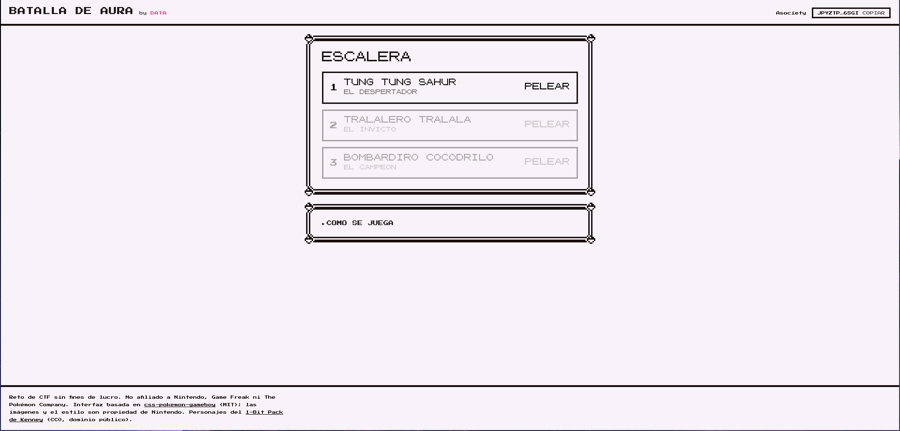
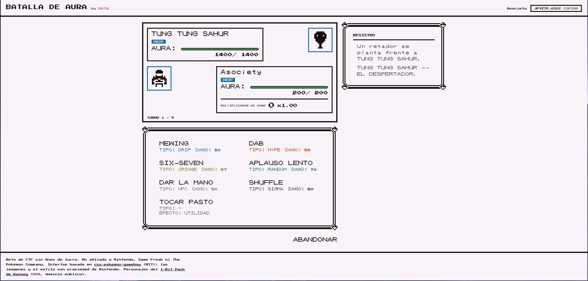

# [Game Hacking] Batalla de aura

## Descripción

Bro thinks he has aura 💀

<http://18.215.118.184:8000/>

## Análisis

La página contiene un juego de combate con tres rivales que debemos derrotar en orden, con movimientos y tipos estilo Pokemon.





Revisando el JavaScript vemos que no hay ningún cálculo client-side, en cada turno solamente envía al servidor el identificador del movimiento seleccionado.

```js
const post = (ruta, cuerpo) =>
  api(ruta, { method: "POST", body: JSON.stringify(cuerpo || {}) });

async function jugar(movimiento) {
  const c = await post("/api/combate/turno", { movimiento });
  pintarCombate(c);
}
```

Para enviar movimientos fácilmente desde la consola, podemos usar el token que la aplicación guarda en `localStorage`:

```js
async function turno(movimiento) {
  const r = await fetch("/api/combate/turno", {
    method: "POST",
    headers: {
      "Content-Type": "application/json",
      "X-Equipo-Token": localStorage.getItem("liga_data_token")
    },
    body: JSON.stringify({ movimiento })
  });

  const estado = await r.json();
  console.log(estado);
  return estado;
}
```

El primer rival, Tung Tung Tung Sahur, cambia de tipo en cada turno siguiendo un ciclo fijo:

```
DRIP -> NPC -> RANDOM -> CRINGE -> DRIP
```

Probando los distintos ataques y observando el campo `eficacia` de la respuesta podemos ver que `SHUFFLE` tiene efectividad x2 contra DRIP y RANDOM, `APLAUSO LENTO` tiene efectividad x3 contra NPC, y `DAR LA MANO` tiene efectividad x2 contra CRINGE. Por lo tanto, usando esta secuencia siempre somos super efectivos y ganamos la batalla:

```
SHUFFLE
APLAUSO LENTO
SHUFFLE
DAR LA MANO
SHUFFLE
APLAUSO LENTO
SHUFFLE
```

Con esto desbloqueamos a Tralalero Tralala, de tipo `SIGMA`. Él tiene una habilidad `SIEMPRE ON`, con la cual recupera toda su AURA antes de que ataquemos, así que necesitamos poder derrotarlo con un solo movimiento, pero ninguno de nuestros movimientos lo logra.

Si vemos el movimiento `TOCAR PASTO` vemos que además de recuperar aura, reduce nuestro multiplicador de daño. Según la interfaz, el movimiento va de -6 a +6, pero si vemos las respuestas del servidor directamente vemos que el valor interno sí sigue disminuyendo.

```
Repetición 10:  mult=-10   mult_display=-6   mult_valor=0.25
Repetición 100: mult=-100  mult_display=-6   mult_valor=0.25
Repetición 128: mult=-128  mult_display=-6   mult_valor=0.25
```

La segunda pelea no tiene límite de turnos y `TOCAR PASTO` recupera suficiente AURA para compensar los ataques de Tralalero. Para no repetir el movimiento manualmente, lo podemos hacer desde la consola:

```js
for (let i = 0; i < 129; i++) {
  await turno("TOCAR_PASTO");
}
```

En la repetición 129 el valor hace overflow, ya que `mult` es un entero con signo de 8 bits:

```
Repetición 129: mult=127   mult_display=6   mult_valor=4
```

Finalmente usamos `SIX SEVEN`, que tiene efectividad x3 contra el tipo `SIGMA` de Tralalero:

```js
await turno("SIX_SEVEN");
```

Combinando el multiplicador x4 obtenido por overflow con la efectividad x3 de `SIX SEVEN` contra SIGMA, el daño resultante (x12) fue suficiente para derrotarlo en un solo turno, antes de que `SIEMPRE ON` pudiera restaurar su AURA.

Con esto se desbloquea la pelea contra Bombardiro Cocodrilo, el cual tiene 880 puntos de AURA y un límite de 6 turnos. Siendo de tipo `NPC` el mejor ataque que tenemos es `APLAUSO LENTO`, pero no es suficiente para matarlo antes de que nos mate.

Si dejamos que se agoten los turnos, Bombardiro usa un movimiento final para atacarnos:

```
BOMBARDIRO COCODRILO usa BOMBARDEO ATOMICO.
Te borra del mapa.
```

## Extracción

Decidí probar usar el movimiento contra él desde la consola, esperando que el servidor no revisara si el movimiento pertenece a mí. Asumiendo que el identificador sería `BOMBARDEO_ATOMICO` (siguiendo el patrón de los demás movimientos, que podemos observar en los requests), corrí:

```js
await turno("BOMBARDEO_ATOMICO");
```

El backend aceptó el movimiento y el ataque derrotó a Bombardiro, regresando la flag en la respuesta de victoria.

## Flag

`AHAU{+1000_de_aura_98ef7683a86ed87b67a}`
