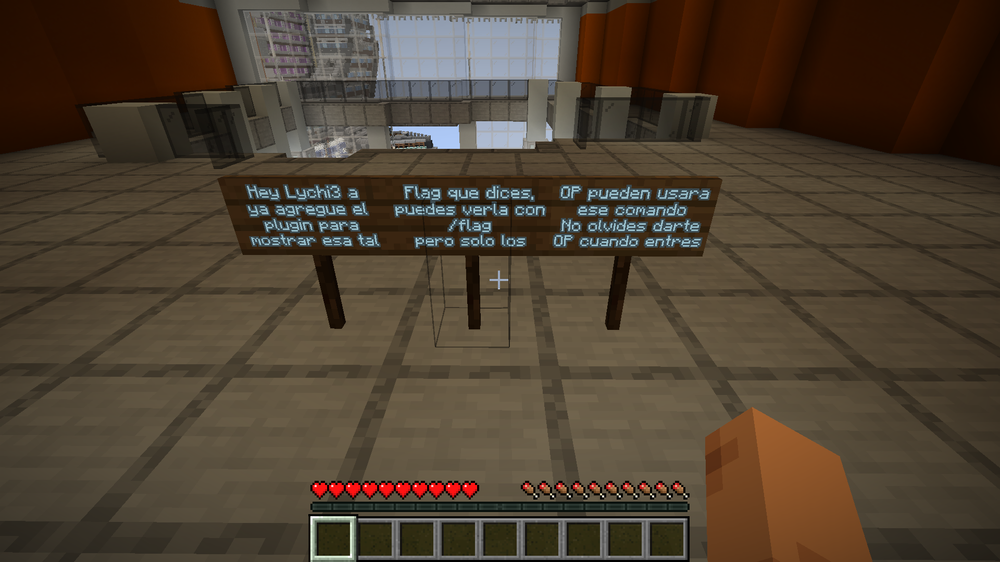

# [Game Hacking] Grief me

## Descripción

AHAU MC: una network de minecraft
Parece estar segura pero detectamos actividad inusual durante un mantenimiento con acceso restringido. Encuentra la falla antes de que nos raideen el servidor.

Lo vas a necesitar: https://prismlauncher.org/ (o el launcher de tu preferencia).

`84.252.113.20:63508 79.127.180.10:62274`

## Análisis

El reto exponía dos servicios distintos. Consultar su estado mediante `mcstatus` reveló que el primero es el proxy y está cerrado por mantenimiento:

```
Java §4Acceso cerrado
AHAU CTF Network - Acceso solo para admins
Tal vez hay otra forma de entrar...
```

El segundo servicio reveló directamente un backend:

```
Paper 1.20.4 (protocolo 765)
Grief Me - Survival
```

Si intentamos entrar al servidor desde Minecraft usando el segundo servicio, Paper responde:

```
If you wish to use IP forwarding, please enable it in your BungeeCord config as well!
```

Esto significaba que Paper esperaba recibir las conexiones a través de BungeeCord. Revisando el source code de BungeeCord y Paper, encontramos que usaban un método antiguo llamado legacy forwarding. Con este método, BungeeCord agrega la IP, el UUID y otros datos del jugador al campo `server_address` del paquete inicial de conexión:

```
hostname\0ip\0uuid\0properties_json
```

(`properties_json` es una lista JSON con propiedades del perfil, como la skin. En este reto usamos `[]`, porque no necesitábamos enviar ninguna propiedad.)

Para comprobarlo escribí `minimal_forwarding.py` con ayuda de Codex, para actuar como puente entre Minecraft y Paper. El script recibe la conexión local de Minecraft y espera los dos primeros paquetes: `Handshake` y `Login Start`. Del segundo obtiene el nombre y UUID del jugador, para poder agregarlo al campo `server_address` del Handshake:

```python
username, player_uuid = parse_login_identity(login_start)

forwarded_hostname = (
    hostname
    + "\x00" + FORWARDED_IP
    + "\x00" + player_uuid.hex
    + "\x00[]"
)
```

El puente envía el Handshake modificado y el `Login Start` original a Paper. A partir de ese momento solo transmite los datos en ambas direcciones. Teniendo esto, podemos iniciar el puente con `python3 minimal_forwarding.py` y conectar Minecraft a `127.0.0.1:25570`; con lo cual Paper acepta la conexión y logramos acceder al servidor.

Ya dentro, hay carteles indicando que la flag se obtiene usando el comando `/flag`, pero únicamente los operadores pueden hacerlo.



Intenté cambiarme el nombre y UUID al del creador del servidor, Lychi3, pero al hacerlo y entrar al servidor la única diferencia era un libro en el inventario que decía:

```
Por seguridad siempre me quito el OP al salir del servidor y me lo agrego al entrar.
```

Por lo tanto, esto no es suficiente y debemos buscar otra forma de volvernos OP. Explorando más, ejecuté `/flag` y apareció el mensaje:

```
[ECB] You don't have permissions to use that command.
```

Es decir, el plugin que bloquea el uso de `/flag` es **EasyCommandBlocker**. Revisando su source code, vemos que registra un canal mediante `Plugin Messages`, la función de Minecraft que permite a los plugins intercambiar información:

```java
registerIncomingPluginChannel(plugin, "ecb:channel", listener);
```

Es decir, Bukkit (API de plugins) le entrega a ECB cualquier mensaje recibido mediante el canal `ecb:channel`. El listener interno de ECB lee dos strings mediante `DataInputStream.readUTF()`:

```
ActionsSubChannel
<acción a ejecutar>
```

Una de las acciones aceptadas es `console_command:`. El texto colocado después de ese prefijo se ejecuta como un comando de la consola de Bukkit. Por ejemplo:

```
ActionsSubChannel
console_command: op <nombre del jugador>
```

hace que ECB ejecute `op <nombre del jugador>` desde la consola, que tiene permisos totales.

La vulnerabilidad era que ECB no verifica de dónde proviene el mensaje; asume que los mensajes enviados por `ecb:channel` proceden del plugin instalado en el proxy. Sin embargo, un jugador conectado directamente al backend también podía enviar un Plugin Message con ese canal y el formato esperado, fabricando el comando necesario para convertirlo en operador.

## Extracción

El siguiente problema era cómo enviar el mensaje a `ecb:channel`. Minecraft vanilla no ofrece ninguna manera para crear un mensaje arbitrario para Plugin Messages, por lo que necesitábamos una forma de controlar una función interna del cliente. Decidí hacerlo mediante un mod para Fabric, ya que nos permite usar el cliente normal de Minecraft y solo modificar lo que necesitamos.

Fabric permite agregar código al cliente y ofrece una API para enviar Plugin Messages. Al final, programé el mod para que cuando Minecraft termina de entrar al mundo, cree los datos del mensaje en un `PacketByteBuf` y los envíe una sola vez mediante `ClientPlayNetworking.send()`:

```java
private static final Identifier ECB_CHANNEL = new Identifier("ecb", "channel");

ClientPlayConnectionEvents.JOIN.register((handler, sender, client) -> {
    PacketByteBuf payload = new PacketByteBuf(Unpooled.buffer());
    writeUtf(payload, "ActionsSubChannel");
    writeUtf(payload, "console_command: op " + client.getSession().getUsername());
    ClientPlayNetworking.send(ECB_CHANNEL, payload);
});
```

La función `writeUtf` reproduce el formato que espera `DataInputStream.readUTF()` para las cadenas ASCII utilizadas por el exploit:

```java
private static void writeUtf(PacketByteBuf output, String value) {
    byte[] encoded = value.getBytes(StandardCharsets.UTF_8);
    output.writeShort(encoded.length);
    output.writeBytes(encoded);
}
```

Tras compilar el mod e instalarlo junto a `Fabric API`, pude comprobar que al entrar al mundo, automáticamente me volvía operador. Con esto, bastó con usar el comando `/flag` para obtener la flag.

## Flag

`AHAU{ku1d4d0_ch1k0s_h4ck3ar0n_el_s3rv3r_d3_m1n3cr4ft}`

## Intentos fallidos

### Entrar por el proxy aunque hubiera mantenimiento

Probé varias versiones del protocolo, nombres virtuales y comandos de BungeeCord como `/glist`, `/server` y `/bungee`. El proxy cerraba la conexión por mantenimiento o respondía `Unknown command`.

### Suplantar a `md_5` o `Lychi3` en el backend

Intenté reemplazar mi UUID con el UUID (online y offline) de ambos nombres. El legacy forwarding permitía controlar la identidad que Paper aceptaba, pero ninguna era OP. El libro explicaba que Lychi3 se retiraba OP antes de salir, así que suplantarlo no era suficiente.

### Buscar variantes de `/flag`

También probé variantes como `/Flag`, `/FLAG`, `/FlAg` y `/ahauctf:flag`. EasyCommandBlocker seguía bloqueando el comando o de plano respondía `Unknown command`.

### Enviar el payload directamente

Pensé en intentar enviar comandos a Paper directamente con `nc`, pero primero era necesario completar el protocolo de Minecraft, entrar al estado `PLAY` y construir el mensaje con el formato adecuado.

### Usar la fecha del libro

El libro mencionaba el 30 de octubre de 2028 como broma de cuando estaría en línea Lychi3 (es decir, le daría operador a la cuenta). Llegué a pensar si podía ser alguna referencia a modificar la fecha, pero Minecraft usa la fecha server-side.
